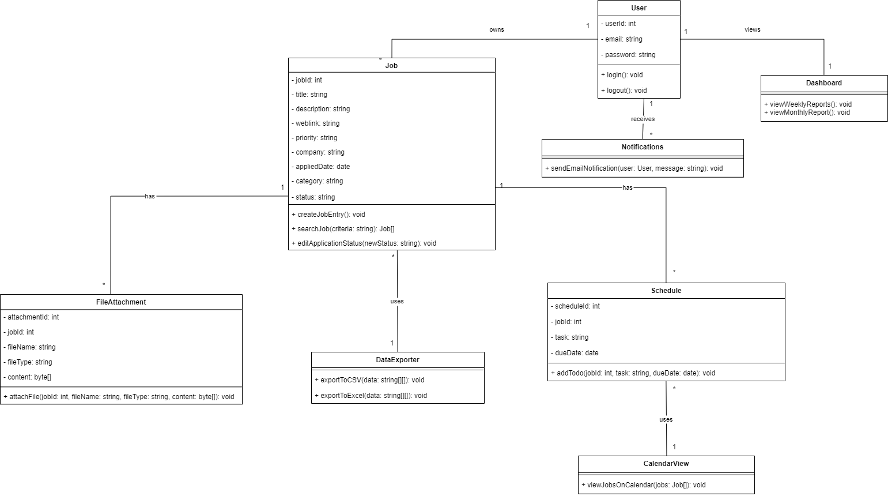

# PROJECT Design Documentation

> _The following template provides the headings for your Design
> Documentation.  As you edit each section make sure you remove these
> commentary 'blockquotes'; the lines that start with a > character
> and appear in the generated PDF in italics._

## Team Information
* Team name: Group5
* Team members
  * Gadadare, Shardul, scg6975
  * Londhe, Soudagar, srl1622
  * Patil, Manasi, mp9259
  * Jadhav, Sakshi, sj9017
  * Shah, Parva, ps7384

## Executive Summary

Our project Titled 'Appli Tracker' is an web based software which helps in creating a Job and tracking the application based on the status. It also allows User to create a Remainder's for upcoming tests or Interview so that it will be easy to track and complete the tasks before the deadlines. Based on number of application user can export the weekly and montly data.

## Requirements

This section describes the features of the application.

### Definition of MVP
MVP in the field of Software Development is used to refer to **Minimum Viable Product**. It refers to a development strategy in which a product is built with only the functionality necessary to satisfy the early adopters or consumers while also gathering valuable feedback for future development. An MVP includes a minimal set of functionality that users demand.  

### MVP Features
 1. Login user : Users can LogIn into the application by using Email and password.
 2. Job creation : Users can create new job entries based on Co-ops or Full Time with a title, description and weblink so that it will be easier to navigate to careers page.
 3. File attachments : Users can attach Resumes, CVs or any documents related to each job entry which they submitted for that particular job.
 4. Priority levels : Users can assign priority levels (e.g., high, medium, low) to the Job.
 5. Search functionality : Users can search a job by company name, applied date, or category.
 6. Tracking : Based on Recruitments reply users can edit and view the application status which makes it easier for tracking.
 7. Data export : Users can export job data to csv or Excel format for further analysis.
 8. Creating schedules : Users can add To-dos for online assessment or Interview rounds.
 9. Calendar view: Users can view jobs on a calendar to visualize deadlines and workload.
 10. Email notifications: Users receive email notifications for any due for pending throughout the day.
 11. Dashboard : Users can view reports for applications on a weekly basis.
 12. Logout user : User can logout from the web application

## Architecture and Design

Based on the Appli Tracker's MVP's following are the Software Architecture and UML diagrams. 

### Software Architecture
# Layered Architectural Diagram

In Presentation Layer i.e User Interface components consist of displaying the Dashboard page with Login and SignUp page in which users can navigate via display easily. In user management layer or configuration layer, components consist of validation and verification of the users credentials, register the new user and managing the users sessions when they are LogIn. Functionality system consists of adding new application details by adding the recruiters information, attaching the required file needed for that application, generating weekly and monthly reports based on the jobs applied, exporting the data to excel format,  searching for a specific application and tracking the application based on status. The system support consists of a Browser and MongoDb database for storing the application’s data.

Each layer has a specific responsibility and interacts with adjacent layers in a well-defined manner which promoted modularity, scalability, and maintainability by isolating different aspects of the system and allowing changes to be made to one layer without affecting the others.

### Use Cases

> _Describe your use case diagram._

### Class Diagram

  1. User class is a class that represents a system user with attributes that include userdid(an integer that uniquely identify the user), email (a string which stores the users email) and password (a string which stores the users password). 

  2. Job class is a class that represents a job in terms of its attributes such as jobid(an integer that uniquely identifies the job), title(a string that stores the title of the job), description(a string that stores the description of the job), weblink(a string that stores the link to where the job is posted), priority(a string, storing priority of this job), company(a string storing hiring company name), appliedDate(date stores when user applied for this job) , category(a string indicating what type of a  category this is) and status(string which shows whether it has been approved or not). 
 
  3. Notification class represents an instance of notification with attributes like notificationid(an integer used to uniquely identify notification), userdid(stores id details about user who was notified by thiis notification) ,jobid(contains id information about jobs on notifications(i.e. where task has been assigned to another person)), message(text contains words used in notifications) and dateTime(date time stamps when each notification was sent). 

  4. ScheduleClass represents list of jobs with attributes such as scheduleid(an integer)i.e., means every schedule will have one number, userid(details about individual who owns given schedule i.e. an employee iD)),”jobId”(an integer storing unique identifier for each particular activity on schedule”); TaskName(String ) – TaskDescription(String ); DueDate(Date ), fileType(String ).

  5. The DataExporter class consists only two methods exportToCSV(data) and exportToExcel(data).

  6. FileAttachment Class defines File Attachment related to Job object having attributes attachmentid(unique identifier for attachment) ,jobId(job id associated with attachment), filename(name under which file was saved at time of uploading it.), fileType(format in which given document was attached), content(stores attachment contents in bytes).

  7. CalendarView class displays a calendar view of user’s job applications.CalendarView has method whose signature reads “void viewJobsOnCalendar(jobs)”.
